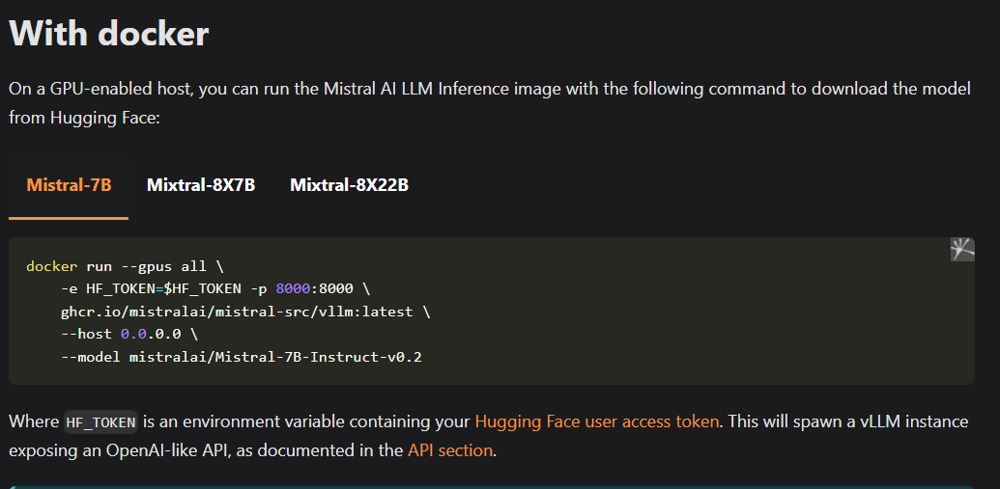

# Introduction

We are using Paid API's for using the LLM (Large Language Model), these days a lot of Open Source Models
are being introduced in the market.

Paid API's

- OpenAI: GPT Model Family
- Antrhopic: Claude, Sonnet Model family
- Geminime: Google LLM

Open Source and Free

- Mistral
- LLAMA (Facebook Model)

# Mistral Github

https://github.com/mistralai/mistral-inference

# Download Model

https://mistral.ai/news/announcing-mistral-7b/

# Issue

The issue which I am encounter is the below one unable to build the container:  
https://github.com/mistralai/mistral-inference/issues/142  
So now I am trying pull the image directly from the huggingface as described below  
https://docs.mistral.ai/deployment/self-deployment/vllm/  

We have 3 different models we can pull and use.

I created a huggingface account and there we need to create an access token and then through that we can use this

Finally it will run a docker container and provide us the below API.

https://docs.mistral.ai/api/