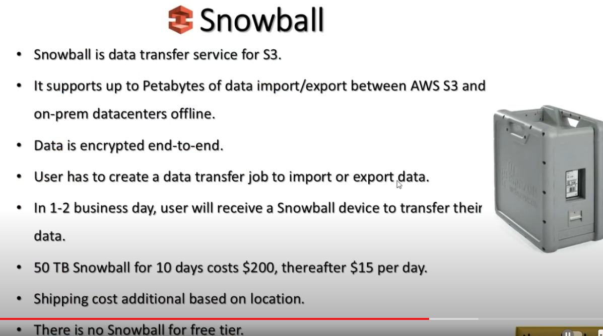

Amazon Snowball:

This service allows you to transfer data from S3 to your on-premise cloud or vice-versa.
It has the physical hardware which will ship to your location in order to achieve.
https://aws.amazon.com/snowball/
https://www.youtube.com/watch?v=9uc2DSZ1wL8
https://www.youtube.com/watch?v=HxEhe0yVyHk
https://www.youtube.com/watch?v=8vQmTZTq7nw

Amazon Inspector:
Amazon Inspector automatically discovers workloads, such as Amazon EC2 instances, containers,
and Lambda functions, and scans them for software vulnerabilities and unintended network exposure.

https://aws.amazon.com/inspector/
https://www.youtube.com/watch?v=wi1PDr9n67Y

File Gateway:
Let say you want to share a file between your peers and you have a on-prem so you can use the file gateway
to connect with the large storage system.
https://aws.amazon.com/storagegateway/file/
https://www.youtube.com/watch?v=XXQNXwx8nfE

Question:
How do you allow EC2 instance so that it is allowed to upload a file on S3 bucket?
You just open up the EC2 instance and then there select the S3 bucket that's it.

Question:
https://aws.amazon.com/cloud-adoption-framework/
AWS Cloud Adoption Framework (AWS CAF)
Business, People, Governance, Platform, Security, and Operations

AWS Fargate:
Let say you have docker deployed on the EC2 instance and in order to meet the demand you itself increase or decrease
the demand of the containers.
https://aws.amazon.com/fargate/
https://www.youtube.com/watch?v=4CHu1ErN51o

Amazon Athena:
You have multiple sources of input data from different sources, and you want to analyze the data you can do it
by using the Amazon Athena.
https://www.youtube.com/watch?v=4CHu1ErN51o
https://www.youtube.com/watch?v=kgwJ9zeWIy0

AWS Compute Optimizer:

You can pass the existing system to the aws compute optimizer, and it will recommend what you can achieve in order
to update the services or workflows for you.
https://aws.amazon.com/compute-optimizer/

AWS Trusted Advisor:

If you have some services are up and you are not using those services then it will tells you about this.
Security by proactively monitoring the AWS environment.
https://aws.amazon.com/premiumsupport/technology/trusted-advisor/

AWS Service Catalog:
https://aws.amazon.com/servicecatalog/
You can write the infrastructure as a code (IaC) using Cloud Formation or Terraform.

AWS Cost Explorer:
https://aws.amazon.com/aws-cost-management/aws-cost-explorer/
Visualize, understand, and manage your AWS costs and usage over time.

AWS Glue:
https://aws.amazon.com/glue/
Discover, prepare, and integrate all your data at any scale.
Get the data from different resources and then make a unified output resources.

Amazon QuickSight:
https://aws.amazon.com/quicksight/?amazon-quicksight-whats-new.sort-by=item.additionalFields.postDateTime&amazon-quicksight-whats-new.sort-order=desc

Gather information from different sources and then visualize them.

AWS Professional Services:
Helping you achieve your desired business outcomes with AWS
https://aws.amazon.com/professional-services/

EC2 instance types:
https://aws.amazon.com/ec2/instance-types/

AWS Elastic Beanstalk:
https://aws.amazon.com/elasticbeanstalk/
You can up and start running your application on the elastic bean stack, and you don't to worry about the underlying
resources.

AWS S3 Versioning:
https://docs.aws.amazon.com/AmazonS3/latest/userguide/Versioning.html
It can save the multiple copies of data into the S3.

AWS CloudFormation:
Speed up cloud provisioning with infrastructure as code
https://aws.amazon.com/cloudformation/

Amazon EC2 Reserved Instances:
https://aws.amazon.com/ec2/pricing/reserved-instances/
You can reduce the pricing when using with the reversed pricing than on-demand pricing.

AWS Direct Connect:
Create a dedicated network connection to AWS
Let say if you want to connect between on-premise and aws cloud infrastructure you can use this aws service.
https://aws.amazon.com/directconnect/

Question:

If you have created a Virtual Private Cloud inside AWS and wants to connect with the outer internet connection
then internet gateway is the answer to your question.

Question:
https://docs.aws.amazon.com/IAM/latest/UserGuide/id_credentials_getting-report.html
You can create a credential report from the AWS IAM for audit purpose.

AWS Budgets:
AWS Budgets is a service that allows you to set custom cost and usage budgets for your AWS resources.
You can configure a budget with a specific threshold and define actions, such as sending notifications,
when that threshold is reached.

Amazon CloudWatch:
Amazon CloudWatch is a monitoring service that can be used to collect and track metrics, logs, and events
from various AWS resources. It supports setting up alarms based on cost metrics, so you can create
an alarm for a specific cost threshold and configure it to send notifications when the threshold is breached.

AWS Artifact:

AWS Artifact provides on-demand access to AWS compliance reports and documents.
It includes various compliance-related documents, such as SOC reports, PCI DSS reports, and more.
While it offers valuable compliance information, it may not directly address the most frequently asked security-related questions.

Amazon Connect:

Amazon Connect is a cloud-based contact center service. It is focused on providing customer service solutions and
does not specifically provide answers to security-related questions.

AWS Chatbot:

AWS Chatbot is a service that allows users to receive notifications and interact with AWS resources
using chat platforms like Slack and Amazon Chime. While it facilitates communication and notifications,
it is not designed to provide answers to frequently asked security-related questions.

AWS Knowledge Center:

AWS Knowledge Center is a resource that provides answers to the most frequently
asked security-related questions that AWS receives from its users. It offers a collection of articles,
videos, and other resources to help users address common security queries and challenges.

AWS Well architecture Framework:
https://docs.aws.amazon.com/wellarchitected/latest/framework/welcome.html

Amazon Simple Notification Service:

Amazon Simple Notification Service (Amazon SNS) sends notifications two ways, A2A and A2P. A2A provides
high-throughput, push-based, many-to-many messaging between distributed systems, microservices,
and event-driven serverless applications. 

Question:
Access keys are used to access by programatically aws resources.

Question:
A company runs thousands of simultaneous simulations using AWS Batch. Each simulation is stateless, is fault tolerant, and runs for up to 3 hours.
Which pricing model enables the company to optimize costs and meet these requirements?

Spot instances

AWS WAF:
https://aws.amazon.com/waf/
Protect your web applications from common exploits.
If you want to protect the from let say sql injection you can use this service.

AWS Identity and Access Management:
Securely manage identities and access to AWS services and resources
https://aws.amazon.com/iam/access-analyzer/
this service identity if the credentials are being shared outside or being used outside.

AWS CloudTrail:
Track user activity and API usage on AWS and in hybrid and multicloud environments

Amazon Redshift:
Power data driven decisions with the best price-performance cloud data warehouse

Amazon Kinesis:
Collect, process, and analyze real-time video and data streams
https://aws.amazon.com/pm/kinesis/

AWS Organizations:
AWS Organizations is an account management service that enables
you to consolidate multiple AWS accounts into an organization that you create and centrally manage.

Amazon Connect:

Customer service cloud contact center
AWS Wavelength:

5G devices

AWS Direct Connect:

Dedicated network connection bypass public network

Amazon CloudFront:
Securely deliver content with low latency and high transfer speeds

AWS Cloud Development Kit:
Define your cloud application resources using familiar programming languages

AWS Security Token Service:
A web service for requesting temporary, limited-privilege credentials for AWS Identity and Access Management users or for users that you authenticate (federated users).

AWS Security Hub:
is a cloud security posture management (CSPM) service that aggregates alerts from various
AWS services and partner products in a standardized format.

On-Demand Instances: On-Demand Instances are suitable for workloads that need flexibility and are short-term or unpredictable. However, they are priced higher than other options.

Dedicated Instances: Dedicated Instances run on hardware dedicated to a single customer account but are priced higher than On-Demand Instances. They may not be the most cost-effective for interruptible workloads.

Spot Instances: Spot Instances allow you to bid for unused EC2 capacity at potentially lower costs. They are suitable for interruptible workloads where you can tolerate potential interruptions. However, they can be terminated with short notice if the capacity is needed by On-Demand or Reserved Instances.

Reserved Instances: Reserved Instances provide a capacity reservation and offer cost savings over On-Demand pricing for a commitment of 1 or 3 years. They are more suitable for steady-state workloads with predictable usage.

Amazon Macie:

Discover and protect your sensitive data at scale

Security groups are stateful firewalls that control inbound and outbound traffic at the instance level. You can configure security groups to allow or deny specific types of network traffic to and from your instances.

Network ACLs (Access Control Lists) are stateless firewalls that control traffic at the subnet level. Network ACLs define rules to allow or deny traffic based on source and destination IP addresses, ports, and protocols.

AWS CloudTrail:
AWS CloudTrail is an AWS service that helps you enable operational and risk auditing, governance,
and compliance of your AWS account. Actions taken by a user, role, or an AWS service are recorded
as events in CloudTrail. Events include actions taken in the AWS Management Console, AWS Command
Line Interface, and AWS SDKs and APIs.
https://docs.aws.amazon.com/awscloudtrail/latest/userguide/cloudtrail-user-guide.html

Amazon Aurora:
fully managed MySQL-compatible database

AWS Outposts Family:
Run AWS infrastructure and services on premises for a truly consistent hybrid experience.
AWS service supports a hybrid architecture that gives users the ability to extend AWS infrastructure,
AWS services, APIs, and tools to data centers, co-location environments, or on-premises facilities

Question:
AWS services or features provide disaster recovery solutions for Amazon EC2 instances
EC2 Amazon Machine Images (AMIs) Most Voted
Amazon Elastic Block Store (Amazon EBS) snapshots 

AWS Transit Gateway:
Connect Amazon VPCs, AWS accounts, and on-premises networks to a single gateway

