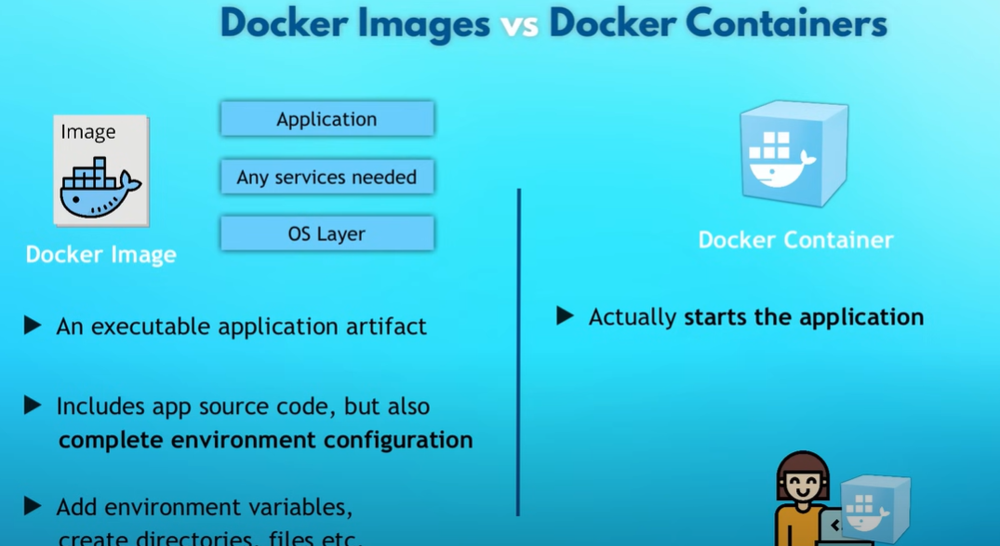

## What is a Docker?

1. It is based on container technology.  
2. It is similar as virtualization but after docker desktop you can run linux on your Windows/ Mac machine.  
3. You create a Docker File for your application, and then you build an image from it.  
4. Now you have the image you can specify a version on your docker image.
5. You can also publish your image private or public on docker hub so other developer team member or people can use.  
6. There are various images present on docker hub like redis, nginx. https://hub.docker.com/ 
7. If you want to run multiple docker container from a single image you use docker_compose.  
8. In docker compose you specify different container which might run which is called as a service like redis, nginx.  
9. Each container has its own ip address and port number from where you can connect with other container or internet.  
10. If you want to run redis different versions you can create multiple containers, and you can run it smoothly.  
11. Docker commands are same irrespective of the operating system.  
13. vLLM Self deployment of the LLM on your local server and building the image on your personal computer
14. is a hectic thing to perform so we can directly pull an image from the docker hub and then run the container.
15. docker run --gpus all \
    -e HF_TOKEN=$HF_TOKEN -p 8000:8000 \
    ghcr.io/mistralai/mistral-src/vllm:latest \
    --host 0.0.0.0 \
    --model mistralai/Mistral-7B-Instruct-v0.2


## Virtualization vs Docker

Operating System Architecture


Architecture for virtualization vs docker


The guest OS (called Hypervisor)means that it grab the resources like RAM,ROM and then run it.

In case of containerization it uses docker engine and then docker engine talk with the same kernel.


Later Docker desktop is developed and through that you can run doker on any machine.  


# Installing Docker For Windows

https://docs.docker.com/desktop/install/windows-install/


# Docker Images vs Containers



Of course, you can run multiple containers from same image.


# Below are some commands:

Ones your docker is installed up and running then   
- List running containers:  
```
docker ps
```

- List all Doker images
```
docker images
```

- Pulling an image from the Docker hub and images are being versioned as well just like software release and docker tags are being used to identity the docker images.
```
docker pull image_name/redis
```

Pulling the specific version we can use the below command.
let say you want to run the redis locally when you run the pull command it first check if it is present locally then
it will run from it otherwise it will fetch the image from the DockerHub and then run the container.

```
docker pull image_name/redis:version_name
```

In order to run a container from the image use the below command.

```
docker run {name}:{tag}
```
Fun Fact!: Docker generates a random name for the container automatically if you don't specify one.

- Run the container in the background
Detach the container 

```
docker run {name}:{tag} -d or --detach
```
It will run in the background and return its container id so how can you see the logs of the container.

```
docker logs container_id
```

