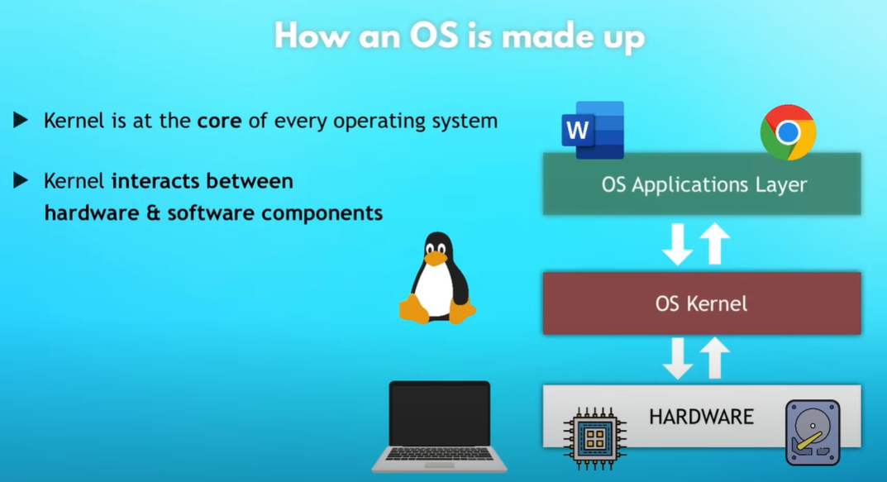
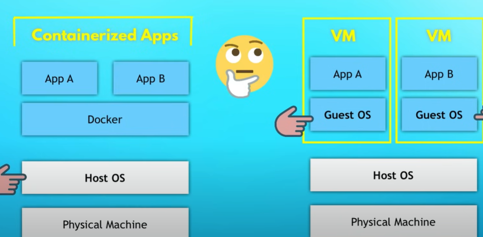
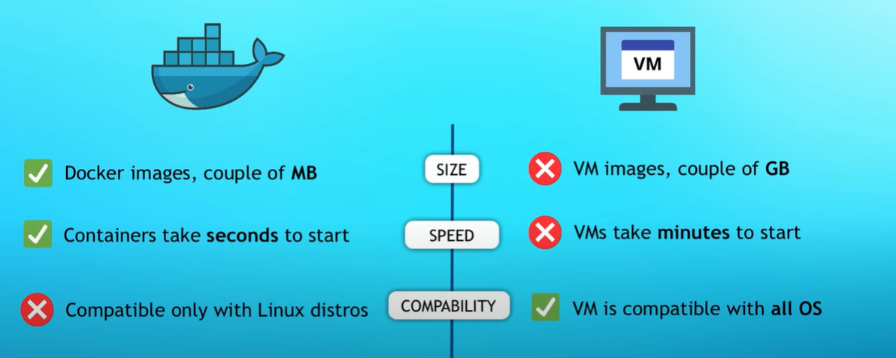

## What is a Docker?

1. It is based on container technology.  
2. It is similar as virtualization but after docker desktop you can run linux on your Windows/ Mac machine.  
3. You create a Docker File for your application, and then you build an image from it.  
4. Now you have the image you can specify a version on your docker image.
5. You can also publish your image private or public on docker hub so other developer team member or people can use.  
6. There are various images present on docker hub like redis, nginx. https://hub.docker.com/ 
7. If you want to run multiple docker container from a single image you use docker_compose.  
8. In docker compose you specify different container which might run which is called as a service like redis, nginx.  
9. Each container has its own ip address and port number from where you can connect with other container or internet.  
10. If you want to run redis different versions you can create multiple containers, and you can run it smoothly.  
11. Docker commands are same irrespective of the operating system.  

## Virtualization vs Docker

Operating System Architecture

Architecture for virtualization vs docker

The guest OS (called Hypervisor)means that it grab the resources like RAM,ROM and then run it.

In case of containerization it uses docker engine and then docker engine talk with the same kernel.

Later Docker desktop is developed and through that you can run doker on any machine.

