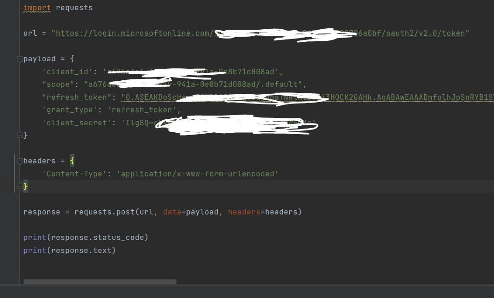
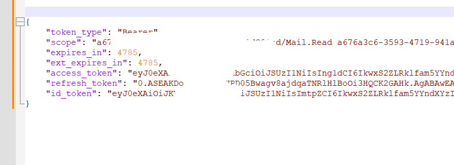
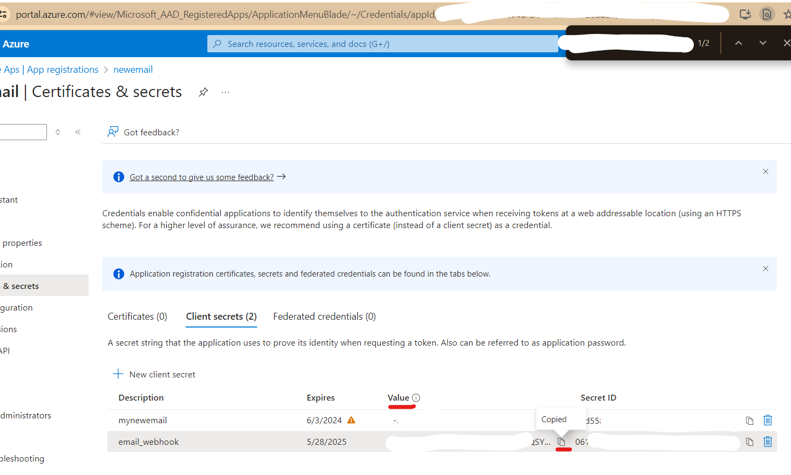
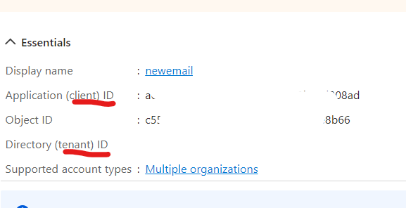
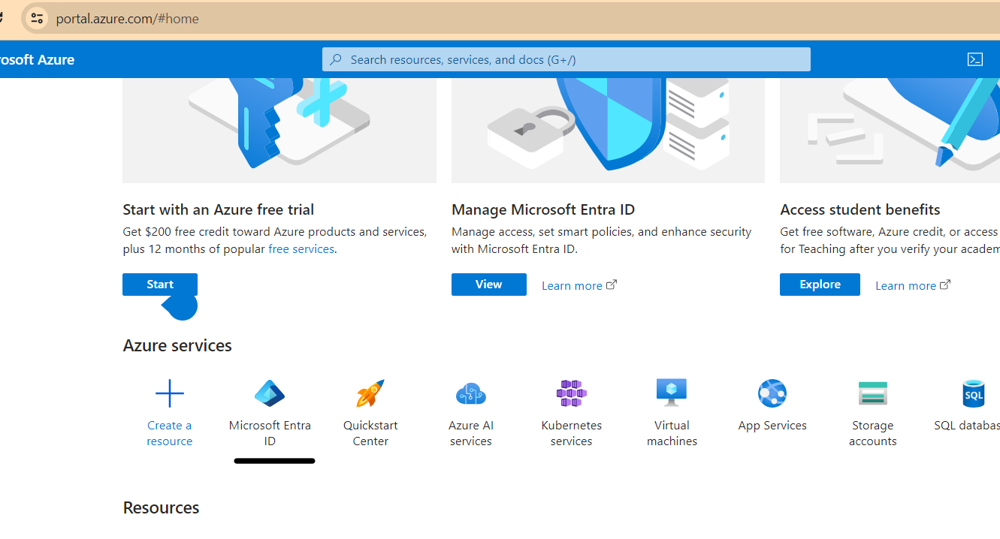

# Microsoft GraphQL API:

Direct URLs:

https://login.microsoftonline.com/{Tenant ID}/oauth2/v2.0/authorize?client_id={AppReg ID}
&response_type=code
&redirect_uri=http%3a%2f%2flocalhost%3a8080
&response_mode=query
&scope={AppReg ID}%2f.default&state=12345&sso_reload=true

https://login.microsoftonline.com/XXXX/oauth2/v2.0/authorize?client_id=XXXX
&response_type=code
&redirect_uri=https://localhost
&response_mode=query
&scope=XXXX%2f.default&state=12345&sso_reload=true

Open up the App which you created and then paste the highlighted client_id and tenant id.

Ones you pasted then open the url in the browser and from there copy and paste the "code".

Make sure you put the redirect_uri what you have configured in your application and it will return something like
the below url:

https://localhost/?code=XXXXXXXX&state=12345&session_state=XXXX

copy the string from the code = and use it afterwards.

Ones you have the code then you need to create a refresh token for the very first time, and then you can repeat
the process in the background to refresh the token.

Copy and paste the client_id and tenant_id and then paste the value.
then create the client_secret and also paste it.

curl -X POST -H "Content-Type: application/x-www-form-urlencoded" -d 'client_id=XXX
&scope=XXX%2f.default openid profile offline_access
&code=XXXX
&redirect_uri=https://localhost
&grant_type=authorization_code
&client_secret=XXXX' 'https://login.microsoftonline.com/XXX/oauth2/v2.0/token'

Ones it is successful then it will return a access_token and a refresh token:

Then you need to create the new access_token from that refresh_token

curl --location --request POST 'https://login.microsoftonline.com/{tenant}/oauth2/v2.0/token' \
--header 'Content-Type: application/x-www-form-urlencoded' \
--data-urlencode 'client_id=11111111-1111-1111-1111-111111111111' \
--data-urlencode 'scope=User.Read Mail.Read' \
--data-urlencode 'refresh_token=0AABA...xUjq...' \
--data-urlencode 'grant_type=refresh_token' \
--data-urlencode 'client_secret=jXoM3iz...'

# Microsoft Graph API Explorer
https://developer.microsoft.com/en-us/graph/graph-explorer

# Official Authentication Library

When working with the authentication flow in any of the API, we have pre-defined libraries
where the security features are already implemented.

https://github.com/AzureAD/microsoft-authentication-library-for-python

# YouTube Link

https://www.youtube.com/watch?v=YRrkIc6Mr2M

# Microsoft Identity Platform

Just like 
google developer console

microsoft also have identity as show in the below picture:

# Microsoft Graph API Events

Event's is an important concept in different application and microsoft graph api support events as well.

https://learn.microsoft.com/en-us/graph/api/subscription-post-subscriptions?view=graph-rest-1.0&tabs=http

https://learn.microsoft.com/en-us/graph/change-notifications-delivery-webhooks?tabs=python

So the event only notify you that the change has occurs but it does not load the complete email for 
that you need to use that email id and then future fetches the email.

