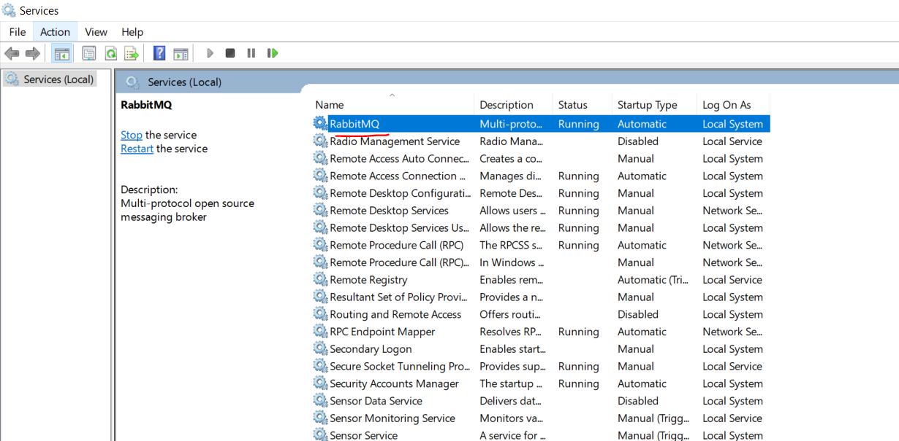
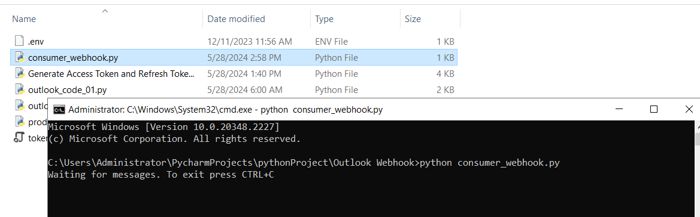

# RabbitMQ Queue

- You need to install RabbitMQ 
https://www.rabbitmq.com/docs/install-windows#installer
https://www.erlang.org/downloads

I am using the Pika API to access the RabbitMQ connection inside python and started my Queue

