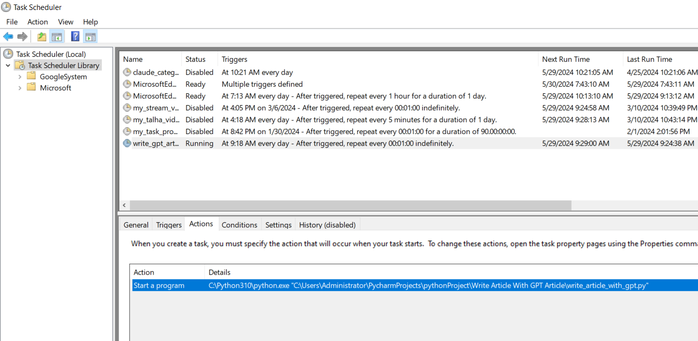
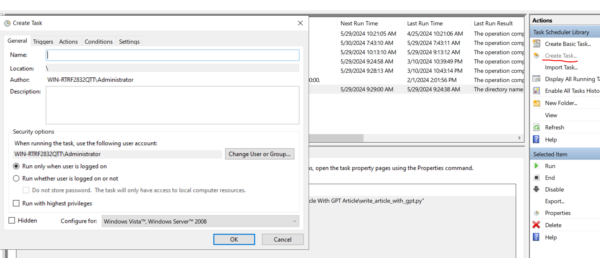
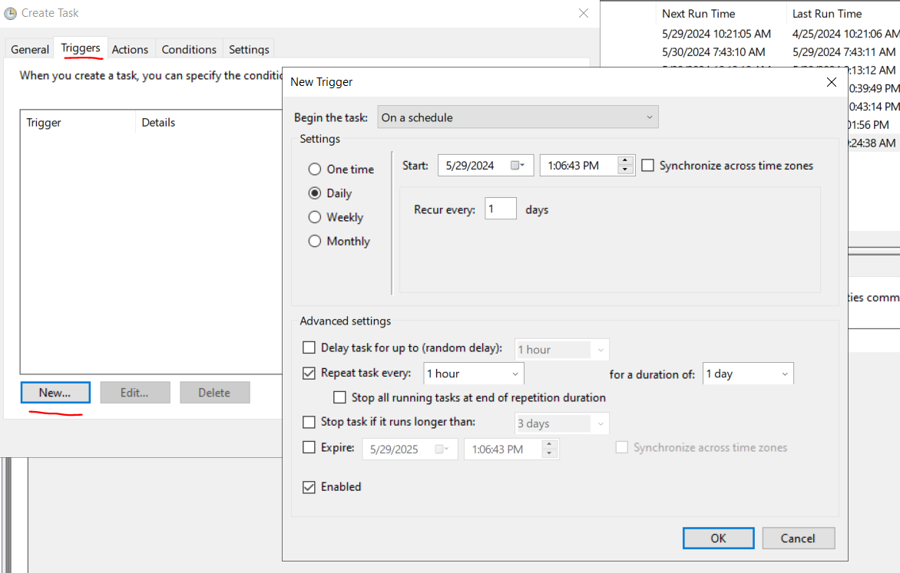
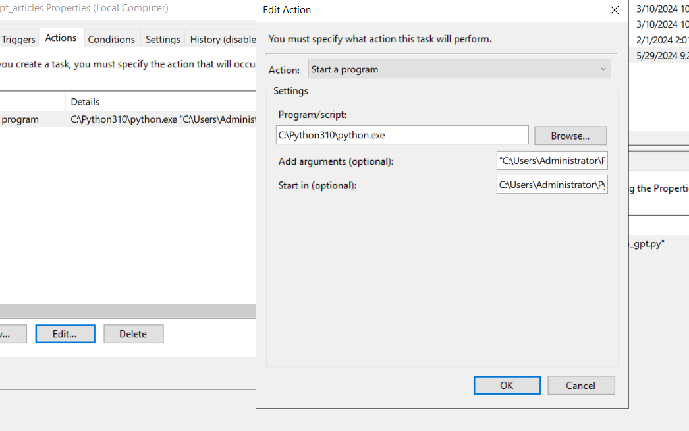
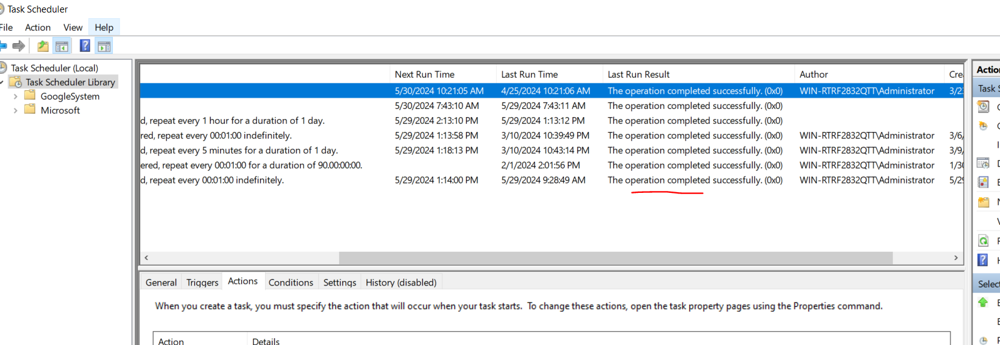

# Task Scheduler

This guide will help you set up a scheduled task on Windows using the Task Scheduler to run a Python script at specified intervals.

## Step-by-Step Guide

### 1. Open Task Scheduler

Search for **Task Scheduler** in the Windows search bar and open it. If necessary, right-click and select **Run as administrator**.

### 2. Create a New Task

Click on **Create Task** in the right-hand Actions pane.

### 3. General Settings

In the **General** tab, provide a name and description for the task so you can easily identify it later.

### 4. Set Triggers

Click on the **Triggers** tab, then click **New** to create a new trigger. Set your preferred schedule and click **OK** to save.

### 5. Set Actions

In the **Actions** tab, click **New** to create a new action. Fill in the details as follows:

- **Program/Script**: `C:\Python310\python.exe` (or the path to your Python executable)
- **Add Arguments (Optional)**: `"C:\Users\Administrator\PycharmProjects\pythonProject\Write Article With GPT Article\write_article_with_gpt.py"`
- **Start in (Optional)**: `C:\Users\Administrator\PycharmProjects\pythonProject\Write Article With GPT Article\`

Make sure to enclose the path in double quotations if it contains spaces.

### 6. Finalize and Save

Click **OK** to save the task. Your task is now set up to run periodically, and you can see its status in the Task Scheduler.

## Congratulations!

You have successfully set up a Python script to run on a schedule using Task Scheduler.

## Tip

Suppose you have a task scheduler that is running, but encounters errors. In such cases, you have the option to restart it. You can utilize the following code to restart the script:

For testing purposes, two scripts, test_script_01.py and test_script_02.py, along with the monitor script, have been provided. You can configure your monitor script within the task scheduler to automate tasks

